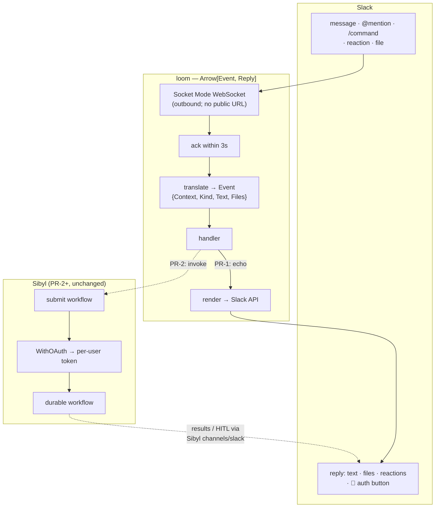

# loom

A Slack front end for [Sibyl](https://github.com/vinodhalaharvi/sibyl), the
agent execution engine. loom listens to Slack over a Socket Mode WebSocket,
turns each event into a typed value, runs a handler, and posts the result
back. It weaves the threads of Slack activity into durable agent execution.

> **Status:** PR-1 — Socket Mode listener + echo handler. No Sibyl
> dependency yet; that arrives in PR-2, where the handler submits a durable
> workflow instead of echoing.

## The idea

Sibyl is the workhorse: durable, Temporal-backed agent execution with
per-agent OAuth. It is unchanged by loom. loom is one *front end* to Sibyl —
a peer of the `agentscript` DSL — that uses Slack as the interface instead of
a command line or a custom language. Slack already solves the hard
interface problems: input and output, file upload/download, identity,
channels as scope boundaries, threads as sessions, mobile, search, history.

The architectural rule (inherited from Sibyl's design): **loom is
presentation and routing only.** Behavior, state, durability, and credential
handling live in Sibyl. loom translates Slack events into Sibyl invocations
and Sibyl results into Slack replies. It never holds a vendor credential.

## How it works



Two directions touch Slack, and they live in different repos on purpose:

- **Ingress** (loom): the Socket Mode listener that receives events. Sibyl's
  `channels/slack` deliberately does *not* listen — it posts and polls — so
  there is no overlap.
- **Egress / HITL** (Sibyl's `channels/slack`): when a *running workflow*
  needs to ask a human something, it posts and waits via Sibyl's existing
  Slack channel. loom doesn't mediate that path.

## Design decisions

- **Single-turn, no streams (YAGNI).** Each Slack event is one
  `Arrow[Event, Reply]` invocation. Multi-message-over-time behavior (a
  workflow posting progress) is reconstructed from *correlation* (thread ↔
  workflow) plus Sibyl's durability — not from a streaming arrow. A streaming
  arrow would duplicate the durability that already lives in Temporal. We add
  one only if a genuine live-stream feature (e.g. token-by-token message
  edits with nothing durable behind them) ever demands it.
- **The 3-second ack.** Slack redelivers any event not acknowledged within
  ~3s. A workflow can take minutes, so the loop acks *immediately* and
  dispatches handling to a bounded worker pool. Results come back
  asynchronously via Sibyl's egress, not as the synchronous response to the
  event. This is exactly why the single-turn model fits: the handler's job
  per event is bounded.
- **Reply is data, not action.** Handlers return a `Reply` value; a single
  `render` step at the edge turns it into Slack API calls. Everything before
  `render` is pure and testable.
- **Slack nouns are context, not arrows.** Channel, user, thread become
  `Context` that rides alongside the data (the analog of Sibyl's
  `AgentContext`). Only `Event → Reply` is composed.

## Running

loom needs two tokens and Socket Mode enabled on your Slack app:

```bash
export SLACK_BOT_TOKEN="xoxb-..."   # Web API: post, react, user info
export SLACK_APP_TOKEN="xapp-..."   # Socket Mode: connections:write

go run ./cmd/loom
```

Slack app setup:

1. Enable **Socket Mode**.
2. Create an **App-Level Token** with `connections:write` → `SLACK_APP_TOKEN`.
3. **OAuth & Permissions** bot scopes: `app_mentions:read`, `chat:write`,
   `reactions:write`, `channels:history`, `im:history` (and `commands` if you
   want slash commands).
4. **Event Subscriptions** → bot events: `app_mention`, `message.channels`,
   `message.im`.
5. Install to the workspace → `SLACK_BOT_TOKEN`.

Then `@mention` the bot in a channel it's in. PR-1 reacts 👀 and echoes your
text back in-thread.

## Layout

```
loom/
├── cmd/loom/main.go   # entry point: reads tokens, runs the listener
├── types.go           # Event, Context, Reply, Handler — the mapping
├── translate.go       # Slack event → loom.Event (the ingress half)
├── listener.go        # Socket Mode connection, ack, bounded dispatch
├── render.go          # Reply → Slack API calls (the one effectful edge)
├── handler.go         # EchoHandler (replaced by a Sibyl handler in PR-2)
└── loom_test.go       # translate / handler / Reply tests
```

## Roadmap

- **PR-1 (this):** Socket Mode listener, typed event mapping, echo handler.
- **PR-2:** depend on Sibyl; `invoke` submits a workflow via a Temporal
  client; `MissingCredentialError` → a "🔑 Authorize" reply.
- **Later:** thread ↔ workflow correlation, channel-scoped agent
  availability ("roles via channels"), file handling, Slack-ID → canonical
  identity mapping.
